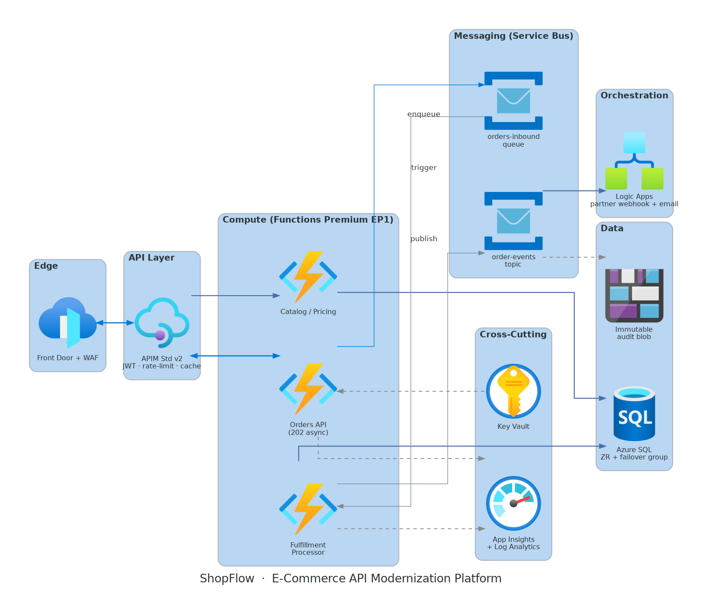

# 🛒 ShopFlow — Enterprise E-Commerce API Platform on Azure

## Architecture Diagram

[]() []() []() []() []()

> Production-grade, event-decoupled e-commerce API platform: **APIM · Azure Functions · Service Bus · Logic Apps · Azure SQL** — designed to absorb 40x flash-sale bursts with zero order loss. 100% Bicep, multi-stage Azure DevOps CI/CD.

**📐 [Architecture Doc](docs/architecture.md) · 📊 [Diagrams](docs/diagrams/) · 📓 [ADRs](docs/adr/) · 🎥 Demo video (link) · ✍️ [Case study blog post](#)**

---

## The Problem

A retailer's monolithic order system crashes under 40x flash-sale traffic, partners integrate via overnight file drops, and releases need downtime windows. ShopFlow replaces point-to-point chaos with a governed API façade and queue-leveled, event-driven fulfillment.

## Architecture



**Request flow:** Front Door (WAF, edge cache) → APIM (JWT validation, rate limits, response cache) → Orders Function (validate → enqueue → `202`) → Service Bus (`orders-inbound` queue) → Fulfillment processor → Azure SQL → `order-events` topic → Logic Apps (partner webhooks + email).

### Key design decisions
| Decision | Rationale | ADR |
|---|---|---|
| Queue-based load leveling | Order intake survives fulfillment outages; 40x burst absorbed | [ADR-001](docs/adr/adr-001-load-leveling.md) |
| Functions Premium over AKS | Ops-proportionate compute; no cluster estate to justify | [ADR-002](docs/adr/adr-002-compute-choice.md) |
| Service Bus over Storage Queues/Event Hubs | DLQ semantics, topics fan-out, sessions | [ADR-003](docs/adr/adr-003-messaging.md) |
| 202-async intake | Burst survival > sync consistency; status API + webhooks | [ADR-004](docs/adr/adr-004-async-intake.md) |
| Managed identities only | Zero credentials in code/config | [ADR-005](docs/adr/adr-005-identity.md) |

## Well-Architected Alignment

| Pillar | Implementation |
|---|---|
| Reliability | Zone-redundant SQL/SB/Functions · DLQ + retry policies · SQL failover group (RTO 4h / RPO 15m) |
| Security | WAF · Entra ID OAuth2 · managed identities · Key Vault refs · TLS 1.2+ · immutable audit blobs |
| Cost | Burst-priced compute · SB Standard · FD caching offloads ~60% reads · budgets + tag taxonomy |
| Operational Excellence | 100% Bicep · what-if gates · PSRule WAF checks · smoke-test gates · DR runbook |
| Performance | Edge + APIM caching · queue backpressure · per-tier limits documented |

## Repository Layout

```
infra/          Bicep modules + env parameter files
src/            .NET 8 isolated Functions (Orders, Catalog, Fulfillment)
workflows/      Logic Apps Standard project
pipelines/      Azure DevOps multi-stage YAML + templates
docs/           Architecture, ADRs, diagrams, runbooks
tests/          Unit + Postman/newman smoke suites
```

## Deploy It Yourself

```bash
# Prereqs: az CLI ≥ 2.60, Bicep, an Azure subscription
az group create -n rg-shopflow-dev -l centralindia
az deployment group what-if -g rg-shopflow-dev -f infra/main.bicep -p infra/main.dev.bicepparam
az deployment group create -g rg-shopflow-dev -f infra/main.bicep -p infra/main.dev.bicepparam
```

Full pipeline setup: [docs/pipeline-setup.md](docs/pipeline-setup.md)

## Observability

Order-funnel workbook (received → queued → fulfilled → notified), distributed tracing via correlation-id propagation APIM→Functions→Service Bus, DLQ-depth and queue-age alerting.

## Cost

Prod ≈ **$650–900/mo** · Dev ≈ **$150/mo** (Consumption tiers). Breakdown + optimization decisions: [docs/architecture.md §12](docs/architecture.md).

---

**Author:** Subhankar Pattnaik — Senior Azure PaaS Engineer · [LinkedIn](https://linkedin.com/in/subhankarpattnaik007) · Part of a 4-project enterprise Azure portfolio (Retail → Finance → Healthcare → Manufacturing).
