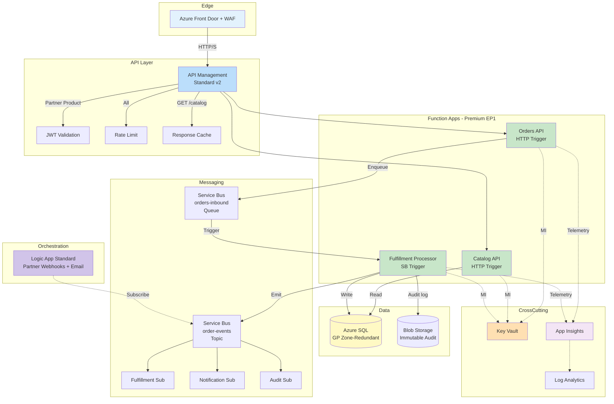

# ShopFlow — Architecture Diagram (Mermaid)

> Copy this into Mermaid Live Editor or your README for an interactive diagram.

```mermaid
graph TB
    subgraph Edge
        FD[Azure Front Door + WAF]
    end

    subgraph API Layer
        APIM[API Management<br/>Standard v2]
        APIM --> |Partner Product| POLICY_JWT[JWT Validation]
        APIM --> |All| POLICY_RATE[Rate Limit]
        APIM --> |GET /catalog| POLICY_CACHE[Response Cache]
    end

    subgraph Compute [Function Apps - Premium EP1]
        ORDERS[Orders API<br/>HTTP Trigger]
        CATALOG[Catalog API<br/>HTTP Trigger]
        FULFILL[Fulfillment Processor<br/>SB Trigger]
    end

    subgraph Messaging
        Q_ORDERS[Service Bus<br/>orders-inbound<br/>Queue]
        T_EVENTS[Service Bus<br/>order-events<br/>Topic]
        T_EVENTS --> SUB_FUL[Fulfillment Sub]
        T_EVENTS --> SUB_NOTIFY[Notification Sub]
        T_EVENTS --> SUB_AUDIT[Audit Sub]
    end

    subgraph Data
        SQL[(Azure SQL<br/>GP Zone-Redundant)]
        BLOB[(Blob Storage<br/>Immutable Audit)]
    end

    subgraph Orchestration
        LA[Logic App Standard<br/>Partner Webhooks + Email]
    end

    subgraph CrossCutting
        KV[Key Vault]
        APPINS[App Insights]
        LOGS[Log Analytics]
    end

    FD --> |HTTP/S| APIM
    APIM --> ORDERS
    APIM --> CATALOG
    CATALOG --> |Read| SQL
    ORDERS --> |Enqueue| Q_ORDERS
    Q_ORDERS --> |Trigger| FULFILL
    FULFILL --> |Write| SQL
    FULFILL --> |Emit| T_EVENTS
    FULFILL --> |Audit log| BLOB
    LA -.-> |Subscribe| T_EVENTS
    ORDERS -.-> |MI| KV
    CATALOG -.-> |MI| KV
    FULFILL -.-> |MI| KV
    ORDERS -.-> |Telemetry| APPINS
    FULFILL -.-> |Telemetry| APPINS
    APPINS -.-> LOGS

    style FD fill:#e3f2fd
    style APIM fill:#bbdefb
    style ORDERS fill:#c8e6c9
    style CATALOG fill:#c8e6c9
    style FULFILL fill:#c8e6c9
    style SQL fill:#fff9c4
    style KV fill:#ffe0b2
    style APPINS fill:#f3e5f5
    style LA fill:#d1c4e9
```
