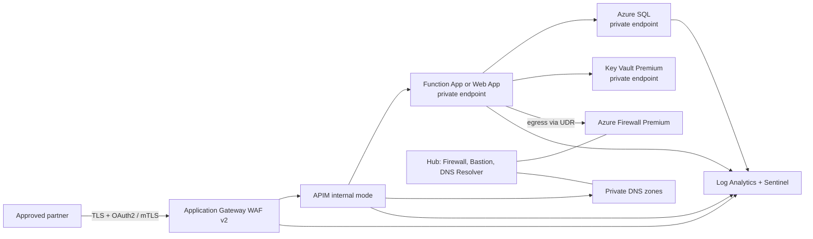

# PaySecure — Zero-Trust Open Banking API Platform
## Complete architecture document (Project 2 of 4)

## 1. Business problem

A regulated bank must expose account-information and payment-initiation APIs to approved third parties while meeting strict audit, data-protection, and operational requirements. The legacy integration model has public application endpoints, inconsistent partner authentication, and no repeatable control preventing teams from enabling public access.

**Scope:** a platform pattern for partner APIs, not a claim of PSD2 certification or a production payment processor. Payment execution and core-banking integration are represented by a private backend contract.

## 2. Functional requirements

1. Register approved partners and expose versioned API products through APIM.
2. Authenticate partners using Entra ID OAuth 2.0 client credentials and require mTLS for high-trust API products.
3. Validate, authorize, rate-limit, transform, and audit each API request.
4. Route requests to private compute services and persist transaction metadata to private Azure SQL.
5. Provide traceability using a correlation ID across WAF, APIM, application, SQL audit, and SIEM.
6. Support controlled promotion of infrastructure and API policies from dev to production.

## 3. Non-functional requirements

| Requirement | Target / design response |
|---|---|
| Availability | 99.95% workload target; zone-redundant supported SKUs; remove single-zone dependencies during detailed design |
| Latency | p95 API gateway processing under 300 ms excluding downstream/core-banking latency |
| Recovery | RTO 4 hours, RPO 15 minutes for the documented reference workload |
| Security | No public backend/data endpoints; TLS 1.2+; least privilege; immutable diagnostic retention |
| Audit | 365-day searchable security retention; longer archive retention subject to bank policy |
| Scale | Start at measured partner TPS; scale APIM/app tiers independently; load-test before capacity commitment |

## 4. Complete Azure architecture

### Hub subscription

- Azure Firewall Premium provides inspected, allow-listed egress and threat-intelligence logging.
- Azure Bastion is the approved administrative entry point; no management VM receives a public IP.
- Azure DNS Private Resolver supports hybrid name resolution where corporate DNS is in scope.
- Private DNS zones are centrally owned and linked to approved spokes.
- Log Analytics and Microsoft Sentinel centralize security telemetry. The exact workspace topology is selected to meet residency and chargeback needs.

### PaySecure spoke subscription

- Application Gateway WAF v2 has the only internet-facing data-plane IP. WAF prevention rules, custom partner allow lists where appropriate, and bot protection are tested before use.
- APIM is deployed in **internal** mode in a dedicated subnet. It validates JWTs, checks products/subscriptions where used, enforces quotas, injects correlation IDs, and routes only to private backend FQDNs.
- Function App Premium and an optional App Service API use regional VNet integration and private endpoints. Managed identities access Key Vault and data services.
- Azure SQL Database uses a private endpoint, Entra-only authentication where supported by the application design, auditing, threat detection, and a failover group.
- Key Vault Premium stores certificates and application secrets only when a managed identity cannot remove the need. HSM-backed keys are a design choice requiring SKU, residency, and crypto-owner approval.

### Architecture diagram (text/Mermaid)



## 5. Azure services and selection rationale

| Service | Why it is selected | Deliberate alternative |
|---|---|---|
| Application Gateway WAF v2 | Regional ingress, TLS policy, OWASP protection, APIM internal exposure | Front Door is added only for global edge/active-active requirements |
| API Management internal | Partner product governance and policy enforcement without public APIM endpoint | External APIM is rejected because backends must stay private |
| Functions Premium | VNet integration, predictable warm capacity, event/API fit | App Service is viable for long-running HTTP workloads; AKS is not justified initially |
| Azure Firewall Premium | Central egress, TLS inspection capability, IDPS/logging | NAT Gateway alone lacks L7 inspection/governance |
| Private Link + Private DNS | Removes public service paths and gives deterministic private resolution | Service endpoints do not provide equivalent private service endpoints |
| Azure Policy | Prevents configuration drift and enables audit/remediation | Manual review cannot scale as a security control |

## 6. Security architecture

- Entra ID is the trust authority; partners use application registrations with narrowly scoped app roles. Client secrets are avoided in favor of certificates or federated workload identity where applicable.
- APIM validates issuer, audience, signature, expiry, scopes/roles, and client certificate thumbprint for mTLS products. Rate limits are per partner and API product.
- Managed identities replace connection strings for Azure resource access. Key Vault RBAC is preferred over broad access policies.
- Defender for Cloud recommendations, SQL auditing, WAF logs, APIM gateway logs, Key Vault diagnostics, and activity logs flow to central monitoring.
- Microsoft Sentinel analytics start with suspicious WAF blocks, abnormal APIM 401/429 spikes, Key Vault access denials, and policy-compliance drift. Detection tuning is an operations activity, not a one-time checkbox.

## 7. Networking and DNS design

The hub owns firewall, DNS, Bastion, and shared monitoring. The spoke has separate subnets for Application Gateway, APIM, and private-endpoint resources; subnet sizing is decided from SKU guidance and growth targets. A UDR sends `0.0.0.0/0` from supported workload subnets to the firewall, while Azure platform exceptions are validated against service requirements. Private DNS zones use a hub-linked resolver model; zone links and private endpoint records are deployed as IaC.

The critical operational test is resolution from every caller: partner path, Application Gateway, APIM, Function App, build agent, and hybrid DNS. Private DNS misconfiguration is treated as a release-blocking test because it commonly produces false “application outage” symptoms.

## 8. Identity and privileged access

- Human administration: Entra groups, PIM-eligible roles, MFA and conditional access governed by the tenant team.
- Workloads: user-assigned managed identities only where lifecycle needs stable identity; system-assigned identities otherwise.
- Delivery: Azure DevOps workload identity federation; no stored Azure client secret. Terraform gets least-privilege roles at the resource-group/subscription scope established by the platform team.
- Emergency access: bank-owned break-glass accounts and documented approval/audit process; no portfolio-created bypass.

## 9. Infrastructure as code

Terraform is organized into `network`, `security`, `api`, and `data` modules. The root configuration accepts only non-secret identifiers and CIDRs. Remote state is designed for an Azure Storage backend with private access, versioning, soft delete, RBAC, and a dedicated state subscription/resource group. State keys are environment-specific; state credentials are obtained through workload identity.

## 10. CI/CD — Azure DevOps

Pull requests run formatting, validation, static security analysis (Checkov/tfsec), `terraform plan`, and policy checks. The plan artifact is retained and production deployment requires an environment approval. Deployment uses OIDC federation and separate dev/prod state keys. Post-deploy tests prove private DNS resolution, expected policy compliance, APIM health, WAF routing, and diagnostic settings.

## 11. Monitoring, logging, and operational response

| Signal | Alert / action |
|---|---|
| WAF blocked requests | Baseline first; alert on anomaly, investigate rule false positives |
| APIM 401/403/429/5xx | Partner, API-product, and backend breakdown; protect against retry storms |
| Private DNS failures | Synthetic resolution test from workload subnet; block promotion |
| Firewall deny / SNAT | Alert on unexpected destination or SNAT exhaustion risk |
| SQL CPU/DTU, failed connections, audit | Capacity review, identity/DNS investigation, preserve audit evidence |
| Policy non-compliance | Remediate automatically only for safe diagnostics; deny risky public exposure |

The runbook defines incident ownership, severity, evidence collection, rollback, and stakeholder communication. Production alert thresholds must be tuned from measured telemetry.

## 12. Cost optimization

Application Gateway WAF, APIM, Firewall Premium, private endpoints, Log Analytics, and Sentinel are security investments with material baseline cost. Use non-production schedules, right-size APIM capacity after load tests, set Log Analytics retention by data class, archive rather than retain hot logs indefinitely, and use budgets/tagging. Do not compromise private connectivity or monitoring simply to reduce a reference environment cost.

## 13. High availability

Use zone-redundant supported SKUs, multiple application instances, availability-zone-aware subnet planning, and health probes. APIM/app scaling is based on measured capacity, not a claim that a single SKU guarantees HA. Dependencies are documented with health checks and circuit-breaker/retry behavior.

## 14. Disaster recovery

Paired-region recovery uses a pre-provisioned secondary spoke, SQL failover group, replicated configuration/IaC, backup validation, and documented DNS/gateway failover steps. Targets are RTO 4h/RPO 15m pending a business impact analysis. Run a tabletop exercise before any production claim; test restoration and partner revalidation rather than merely failing over infrastructure.

## 15. Scalability strategy

Scale the edge, gateway, compute, and data tiers independently. APIM quotas protect both partner fairness and backend capacity. Functions Premium scales from observed concurrency; SQL is monitored for vCore/IO constraints. For asynchronous payment-status workflows, add Service Bus with idempotency keys rather than holding synchronous connections open.

## 16. Folder and repository structure

```text
project-2-paysecure/
  infra/             Terraform root, modules, environment examples
  pipelines/         OIDC-based Azure DevOps pipeline
  docs/              threat model, diagram, ADRs, runbook
  ARCHITECTURE.md    end-to-end design and WAF alignment
  interview-prep.md  defensible architecture discussion
```

## 17. Resume impact

Use the statement in the README only for a portfolio/design exercise. It demonstrates a credible extension of Azure PaaS, DevOps, DINE policy, and escalation experience; it does not claim regulated-bank delivery or compliance certification.

## 18. Architecture trade-offs

1. **App Gateway plus APIM:** two layers add cost/latency but separate web protection/ingress from API product/policy governance.
2. **Private endpoints:** reduce attack surface but make DNS, self-hosted build agents, and troubleshooting more complex.
3. **Firewall Premium:** provides central control but requires explicit FQDN/egress design and SNAT capacity monitoring.
4. **Terraform:** supports modular multi-subscription delivery but requires disciplined state isolation and provider version governance.
5. **mTLS:** improves partner assurance but introduces certificate issuance, rotation, and revocation operations.

## 19. Future enhancements

- Multi-region active-active partner ingress with Front Door Premium and regional APIM strategy.
- APIM developer portal integration with partner onboarding workflow and certificate lifecycle automation.
- API schema registry/contract testing, DLP classification, and immutable WORM audit archive.
- Chaos testing for DNS, firewall, APIM, and SQL failover scenarios.
