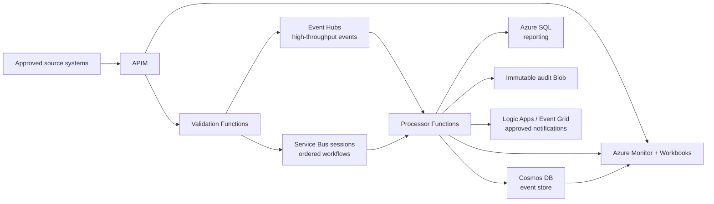

# MediSync — Event-Driven Patient Data Interoperability Hub
## Complete architecture document (Project 3 of 4)

## 1. Business problem

A hospital group operating twelve facilities has point-to-point interfaces and delayed patient-event exchange. It needs a reliable, auditable path for ADT-style events and FHIR resources while preserving data minimization, ordered clinical workflows, and regional recovery capability.

## 2. Functional requirements

1. Receive authenticated clinical events and FHIR-style resources from approved systems.
2. Validate schema, add a correlation ID, reject malformed payloads without exposing PHI in errors.
3. Route high-throughput streams to Event Hubs and ordered workflow commands to Service Bus sessions.
4. Process events idempotently; persist event state in Cosmos DB and relational reporting data in Azure SQL.
5. Publish approved, least-data downstream notifications through Logic Apps/Event Grid.
6. Create immutable audit records for access, processing, and administrative operations.

## 3. Non-functional requirements

| Area | Target/design response |
|---|---|
| Reliability | Per-component health probes, retry/DLQ handling, tested replay path |
| Recovery | RTO 1 hour / RPO 5 minutes for priority event flows; validate by BIA and exercise |
| Ordering | Service Bus sessions for clinical workflows requiring per-patient ordering; Event Hubs for high-rate streams |
| Security | Private endpoints, managed identities, least privilege, CMK where required, immutable audit archive |
| Performance | Partitioning based on measured producer/consumer throughput; backpressure is observable |
| Privacy | Minimum necessary data, role-based access, retention/deletion rules owned by governance |

## 4. Complete Azure architecture

### Ingress and validation

APIM exposes controlled ingestion APIs. Functions validate request size/schema and produce a correlation ID. Request payload logging is disabled or redacted; diagnostic sampling must not capture PHI. Entra ID OAuth2, client certificates where justified, and APIM product/subscription controls establish caller identity.

### Eventing split

Event Hubs carries high-throughput, append-only ADT/telemetry-style streams. Partitions scale consumer throughput; the partition key is selected to avoid hot partitions and does **not** make a broad ordering promise. Service Bus queues/topics use sessions for ordered, stateful workflow commands, duplicate detection where appropriate, retries, and a DLQ. Event Grid is limited to lightweight reactive notifications and is not used as the durable clinical workflow backbone.

### Processing and data

Function processors use managed identities, idempotency keys, and explicit poison-message handling. Cosmos DB is the event/query store with a documented partition strategy; Azure SQL supports relational reporting/operational queries. Blob Storage stores append-only audit exports with immutability policies. Logic Apps calls approved downstream endpoints using managed identity or Key Vault-referenced partner credentials.

### Architecture diagram

## 5. Azure services and rationale

| Service | Role | Alternative/trade-off |
|---|---|---|
| APIM | Govern inbound API contract and authentication | Direct Functions ingress lacks mature product/policy controls |
| Event Hubs | High-throughput streaming and replay | Service Bus is not cost/performance optimal for broad event streams |
| Service Bus | Ordered workflows, DLQ, sessions, duplicate detection | Event Hubs does not provide equivalent queue semantics |
| Functions Premium | Serverless processing with VNet integration and predictable warm capacity | AKS is considered only if sustained complex processing requires it |
| Cosmos DB | Low-latency event/query access with multi-region options | SQL alone constrains event-scale and flexible event shape |
| Blob immutable storage | Defensible audit archive | Log retention alone is not a complete evidence/archive strategy |

## 6. Security, privacy, and identity

- All data services use private endpoints and public network access is disabled after operational validation.
- Managed identities replace service credentials; Key Vault holds only unavoidable certificates/secrets.
- Customer-managed keys are a governance decision with key-owner, rotation, regional, and break-glass procedures—not merely an encryption checkbox.
- Entra groups and RBAC implement least privilege; privileged access uses tenant-owned MFA/PIM policy.
- Data classification, retention, subject-access, legal-hold, and consent decisions are documented requirements for the hospital, not solved automatically by Azure services.
- Diagnostics use allow-listed fields; payload and identifier redaction is tested. PHI never appears in pipeline logs, alert text, sample data, or repository fixtures.

## 7. Networking

The workload uses a spoke VNet with dedicated private-endpoint and integration subnets. Private DNS zones are centrally governed and tested from each producer/consumer path. Outbound traffic follows approved egress controls. Self-hosted build agents are required if public endpoints are fully disabled; hosted agents cannot magically reach private control/data planes.

## 8. IaC and CI/CD

Bicep is used for modular resource definitions and `what-if`; deployment parameters contain identifiers and SKUs only, never secrets. Azure DevOps validates Bicep, runs PSRule-style checks where available, produces a what-if artifact, and requires environment approval for production. Workload identity federation is preferred over a stored service-principal secret.

## 9. Observability and operations

Dashboards cover accepted/rejected events, Event Hubs consumer lag, Service Bus active/DLQ/session metrics, Function failures/duration, Cosmos RU/429s, SQL health, private DNS test results, and end-to-end correlation. Alert messages contain opaque correlation IDs rather than patient attributes. A clinical operations team owns workflow exceptions; platform engineering owns availability and telemetry.

## 10. Cost, HA, and DR

Capacity is driven by measured event rate, payload size, retention, consumer lag, Cosmos RUs, and audit volume. Start with conservative non-production tiers and load tests. Use zone-redundant supported services, multi-instance processors, and backpressure controls. For DR, Event Hubs Geo-DR aliases protect namespace metadata but not event data replication; application-level replay/secondary ingestion must be designed. Cosmos multi-region write versus single-write is an explicit latency/conflict/cost decision. Validate RTO 1h/RPO 5m with a recovery exercise.

## 11. Architecture trade-offs

1. Event Hubs and Service Bus are both retained because throughput and ordered workflow delivery are different problems.
2. Cosmos DB supports event-oriented scale but requires deliberate partition and consistency design.
3. CMK and private endpoints increase control but also introduce DNS, key availability, and operational dependencies.
4. Multi-region writes improve locality/resilience but add conflict-resolution and cost complexity; choose only with a documented use case.
5. Immutable audit archives preserve evidence but require privacy-aware retention and deletion/legal-hold governance.

## 12. Future enhancements

- Synthetic FHIR bundle generator and contract tests with no real patient data.
- Schema registry and compatibility gates.
- Data-quality scorecard, consent/consumption policy integration, and de-identification pipeline.
- Chaos tests for Event Hubs consumers, Service Bus sessions, Cosmos regional failover, and private DNS.
