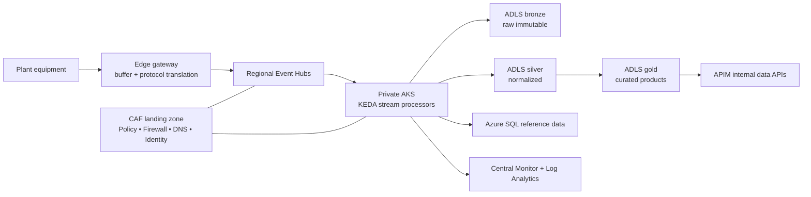

# EdgeForge — Global IoT Telemetry Platform on an Enterprise Landing Zone
## Complete architecture document (Project 4 of 4)

## 1. Business problem

A manufacturer with forty plants across three regions needs predictive-maintenance telemetry without exposing operational technology networks, while allowing future digital workloads to use the same governed Azure foundation. Plant connectivity is intermittent; raw data volume is high; operations require regional resilience, cost visibility, and clear ownership.

## 2. Functional requirements

1. Collect plant telemetry through a controlled edge gateway with buffering during connectivity loss.
2. Ingest events regionally, process them near the source region, and retain raw/curated data zones.
3. Scale stream-processing workloads with load while protecting shared platform capacity.
4. Expose approved telemetry-derived data products through governed APIs or analytics paths.
5. Provision subscriptions, policies, networks, and workload resources from code.
6. Centralize security, operational, and cost telemetry with separated platform/workload accountability.

## 3. Enterprise landing zone

### Management group hierarchy

```text
Tenant Root
├── Platform
│   ├── Identity
│   ├── Management
│   └── Connectivity
├── Landing Zones
│   ├── Corp
│   └── Online
├── Sandbox
└── Decommissioned
```

Subscriptions are separated for connectivity, management/security, shared services, and each production/non-production workload environment. This limits blast radius, supports cost allocation, and lets platform teams enforce guardrails without owning application releases.

### Governance

Policy initiatives establish permitted regions, required tags, diagnostic settings, Defender plans, private-endpoint expectations, allowed SKUs, and blocked public IP/resource exposure. Start new controls in Audit, remediate safe diagnostics with DeployIfNotExists, and promote proven non-negotiable controls to Deny with an exemption process. Policy-as-code is versioned separately from workload deployments.

## 4. Workload architecture

Plant gateways publish telemetry through approved edge connectivity. Regional Event Hubs provides high-throughput ingestion; AKS processors consume partitions and KEDA scales on consumer lag. Data lands in ADLS Gen2 zones: bronze (immutable/raw), silver (validated/normalized), gold (curated data products). Azure SQL holds operational/reference data where relational behavior is required. APIM exposes authorized internal data products.



## 5. Service-selection decisions

| Service | Why | Alternative / boundary |
|---|---|---|
| Edge gateway / Stack Edge narrative | local buffering and protocol boundary for constrained sites | edge hardware/software is selected with OT teams; Azure does not replace plant safety systems |
| Event Hubs | regional high-rate telemetry ingress | Service Bus is used only for command/workflow semantics |
| Private AKS | long-running, containerized stream processors and KEDA | Functions suit smaller event-driven tasks; AKS is justified by sustained processing control |
| KEDA | scales consumers on Event Hubs lag/metrics | HPA alone does not express all event-driven signals as directly |
| ADLS Gen2 | cost-efficient lake with hierarchical namespace/data zoning | not a transactional plant-control database |
| APIM | governed internal data product boundary | not a replacement for a full analytics serving platform |

## 6. Security, networking, and identity

- Separate IT and OT trust boundaries. No inbound path from cloud directly controls plant equipment in this reference design.
- Private AKS, private endpoints, private DNS, firewall-controlled egress, and no public IPs on worker nodes.
- Workload Identity maps Kubernetes service accounts to narrowly scoped managed identities; no static cloud credentials in pod manifests.
- Edge device identity/certificate lifecycle is owned with the device/OT security model. Rotate and revoke identities; never embed device keys in Git.
- Central logging captures platform security signals and workload health while redacting payloads and limiting telemetry access.

## 7. Reliability, DR, and failure modes

Ingestion is active-active across regional Event Hubs. Analytics is active-passive or independently recoverable based on cost and business need. Plant edge buffers protect against WAN interruption; recovery includes duplicate/idempotent processing when connectivity returns. AKS node pools span zones where supported, and processor checkpoints/replay are tested. A regional outage runbook covers producer routing, consumer restart/checkpoint, data reconciliation, and API degradation.

| Scenario | Design response |
|---|---|
| Plant WAN outage | edge buffer, local retention limits, alerting, controlled replay |
| Consumer lag spike | KEDA scale-out, partition/capacity assessment, backpressure alerts |
| Region outage | approved producer failover, replay/checkpoint recovery, secondary analytics plan |
| Bad deployment | GitOps/pipeline rollback, immutable image, progressive release and health gates |
| Policy blocks change | documented exemption with owner/expiry; no manual bypass |

## 8. DevSecOps and operations

Terraform provisions landing-zone and workload structure; Bicep is used for Azure Policy definitions where it suits native resource policy artifacts. Azure DevOps uses OIDC federation, static checks, plan/what-if artifacts, policy validation, approved environments, and post-deployment smoke tests. Container images are scanned and signed according to the organization’s supply-chain policy. GitOps is a future enhancement when an operational cluster and reconciler model are chosen.

## 9. FinOps

Tag every subscription/resource with owner, workload, environment, cost center, data classification, and criticality. Budgets, anomaly alerts, and allocation views sit at subscription and management-group scope. Primary levers are Event Hubs capacity/retention, AKS autoscaler/KEDA thresholds, spot nodes only for interruptible workloads, ADLS lifecycle tiering, Log Analytics retention, reservations/savings plans after stable usage, and non-production schedules.

## 10. Interview trade-offs

1. Hub-spoke provides explicit control and inspection; Azure Virtual WAN can reduce global connectivity operations at scale. Choose based on network footprint and operating model.
2. AKS gives processing flexibility but creates a cluster operating responsibility; do not select it simply because Kubernetes is fashionable.
3. Active-active ingestion does not require active-active analytics; separate the RTO/RPO of data capture from dashboard/report recovery.
4. Deny policy is strong governance but must be introduced with evidence, exemption ownership, and developer guidance.
5. Edge buffering improves resilience but makes replay, ordering, time synchronization, and device lifecycle first-class concerns.


## 10a. Architecture Decision Records (ADR)

Key architectural decisions for EdgeForge, documenting the choices behind the enterprise-scale landing zone and global IoT platform.

| ADR | Decision | Rationale |
|-----|----------|-----------|
| [ADR-001](docs/adr/adr-001-caf-landing-zone.md) | CAF-aligned management group hierarchy | Policy-as-code governance scales to 100+ workloads; subscription-based cost allocation per plant |
| [ADR-002](docs/adr/adr-002-aks-keda-stream-processing.md) | AKS + KEDA for stream processing over ASA | Custom enrichment (sensor calibration, anomaly scoring) exceeds declarative query capability |
| [ADR-003](docs/adr/adr-003-active-active-ingestion.md) | 3-region active-active Event Hubs ingestion | <50ms latency per plant; local buffering during network partitions; regional data sovereignty |
| [ADR-004](docs/adr/adr-004-policy-as-code-rollout.md) | 40+ policies as code via Terraform (deny/audit/DINE) | Hard network/security guardrails; audit trail for compliance; version-controlled exemptions |


## 11\. Future enhancements

- GitOps (Flux) for AKS manifests, signed images, admission control, and progressive delivery.
- Microsoft Fabric/Synapse/Databricks selection based on analytical user patterns and data governance.
- Digital-twin modeling, anomaly detection, and MLOps only after data quality/labeling and ownership are proven.
- Chaos experiments covering region loss, Event Hubs lag, DNS loss, and node-pool failure.
